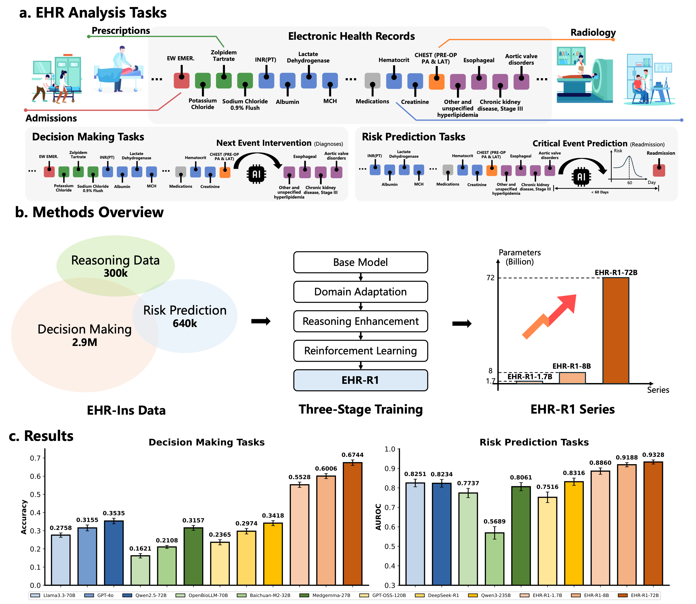

# Toward Reasoning-Enhanced Large Langugage Models for EHR Analysis
[](https://arxiv.org/pdf/2510.25628) 
[]()
[](https://huggingface.co/datasets/BlueZeros/EHR-Bench)

[](https://huggingface.co/BlueZeros/EHR-R1-1.7B) 
[](https://huggingface.co/BlueZeros/EHR-R1-8B) 
[](https://huggingface.co/BlueZeros/EHR-R1-72B) 

We introduce a large-scale, high-quality dataset and a specialized, reasoning-enhanced LLM, **EHR-Ins**, contains **3.5M** of cases across **42** diverse EHR tasks and **300k** synthesized EHR reasoning chains. Building upon this dataset, we developed **EHR-R1** series, a family of LLMs up to 72B parameters, trained through a three-stage curriculum involving domain adaptation, reasoning enhancement, and reinforcement learning.

----------------------------------------
## 🔖 **TOC**
  * [**KeyPoint**](#--keypoint--)
  * [**Directly Use**](#--directly-use--)
    + [**EHR Input Format**](#ehr-input-format)
    + [**Models Inference**](#--models-inference--)
  * [**Quick Start**](#--quick-start--)
    + [**Step 1: Enviorment Install**](#--step-1--enviorment-install--)
    + [**Step 2: Preprocess Data**](#--step-2--preprocess-data--)
    + [**Step 2: Training LLMs**](#--step-2--training-llms--)
    + [**Step 3: Evaluation**](#--step-3--evaluation--)
  * [**Advanced Usage**](#--advanced-usage--)
    + [**Generate Custom Index File**](#generate-custom-index-file)
    + [**Generate Reasoning Data**](#generate-reasoning-data)
  * [**Citation**](#citation)
## 💡 **KeyPoint**
* We open-source a large-scale instruction dataset [**EHR-Ins**](data_url), including 3.5M non-reasoning data and 300k reasoning data.

* We open-source a comprehensive benchmark [**EHR-Bench**](data_url), which covers 42 distinct EHR analysis tasks.

* We open-source EHR reasoning-enhanced LLMs **EHR-R1**, including [**EHR-R1-1.7B**](https://huggingface.co/BlueZeros/EHR-R1-1.7B), [**EHR-R1-8B**](https://huggingface.co/BlueZeros/EHR-R1-8B), and [**EHR-R1-72**](https://huggingface.co/BlueZeros/EHR-R1-72B)

* We open-source the "thinking-graph" pipeline, which can synthesize reasoning chains for EHR analysis tasks according to the relation of EHR entities.



----------------------------------------

## ⚡ **Directly Use**
### **EHR Input Format**
For any EHR data, keep the EHR input with markdown format as below:
* For the event with signle record:
```markdown
## Evant Name [Event Time (YYYY-MM-DD HH:MM:SS)]
- ItemKey_1: ItemValue_1
- ItemKey_2: ItemValue_2
- ItemKey_3: ItemValue_3
```
* For the event with multiple records (like labevents):
```markdown
## Evant Name [Event Time (YYYY-MM-DD HH:MM:SS)]
 |  ItemKey_1  |  ItemKey_2  |  ItemKey_3  |
 |  ---------  |  ---------  |  ---------  |
 | ItemValue_1 | ItemValue_2 | ItemValue_3 |
 | ItemValue_1 | ItemValue_2 | ItemValue_3 |
 | ItemValue_1 | ItemValue_2 | ItemValue_3 |
```

### **Models Inference**
* Inference with **VLLM** (Recommand for faster decoding)
```python
from vllm import LLM, SamplingParams
model_name = "{Path to EHR-R1}"
model = LLM(
    model=model_name, 
    tensor_parallel_size=torch.cuda.device_count(), 
    trust_remote_code=True, 
    max_model_len=32000, 
    max_seq_len_to_capture=32000, 
    gpu_memory_utilization=0.7
)

ehr_input = "{YOUR FOMATTED EHR INPUT}"
instruction = "{YOUR TASK INSTRUCTION}"
messages = [
    {"role": "system", "content": "You are a helpful assistant."},
    {"role": "user", "content": ehr_input + "\n" + instruction}
]

# For EHR-R1-1.7B & EHR-R1-8B, control the reasoning mode by setting enable_thinking
text = tokenizer.apply_chat_template(
    messages,
    tokenize=False,
    add_generation_prompt=True,
    enable_thinking=False,
).to(model.device)
# For EHR-R1-72B, you can manually add <think>\n\n<\think>\n at the end of the model_inputs to close the reasoning modes.
text += "<think>\n\n</think>\n"

sampling_params = SamplingParams(
    temperature=0.0,
    max_tokens=2048
)

outputs = model.generate(
    text, 
    sampling_params=sampling_params, 
    use_tqdm=False
)
print(output)
```
> **Note**: You can control the reasoning mode of EHR-R1-1.7B and EHR-R1-8B by setting `enable_thinking` parameters. However, the tokenizer of the EHR-R1-72B miss the enable_thinking parameters and will enable the reasoning mode automatically. You can manually add `<think>\n\n<\think>\n` at the end of the `model_inputs` to close the reasoning modes.

* Inference with **Transformers**
```python
from transformers import AutoModelForCausalLM, AutoTokenizer
model_name = "{Path to EHR-R1}"
model = AutoModelForCausalLM.from_pretrained(
    model_name,
    torch_dtype="auto",
    device_map="auto"
)
tokenizer = AutoTokenizer.from_pretrained(model_name)
ehr_input = "{YOUR FOMATTED EHR INPUT}"
instruction = "{YOUR TASK INSTRUCTION}"
messages = [
    {"role": "system", "content": "You are a helpful assistant."},
    {"role": "user", "content": ehr_input + "\n" + instruction}
]

# For EHR-R1-1.7B & EHR-R1-8B, control the reasoning mode by setting enable_thinking
text = tokenizer.apply_chat_template(
    messages,
    tokenize=False,
    add_generation_prompt=True,
    enable_thinking=False,
).to(model.device)
# For EHR-R1-72B, you can manually add <think>\n\n<\think>\n at the end of the model_inputs to close the reasoning modes.
text += "<think>\n\n</think>\n"

model_inputs = tokenizer([text], return_tensors="pt").to(model.device)
generated_ids = model.generate(
    **model_inputs,
    max_new_tokens=2048,
    temperautre=0.0
)
generated_ids = [
    output_ids[len(input_ids):] for input_ids, output_ids in zip(model_inputs.input_ids, generated_ids)
]
response = tokenizer.batch_decode(generated_ids, skip_special_tokens=True)[0]
print(response)
```

----------------------------------------

## 📙 **Quick Start**
### **Step 1: Enviorment Install**
```bash
pip install -r requirements.text
```

### **Step 2: Preprocess Data**
* **(Option 1)** Download Dataset from [Physionet](https://physionet.org/content/mimic-iv-ehr-analysis/1.0/). Put  into `./datas` and unzip all files. The directory is as follow:
```
mimic-iv-ehr-analysis/
├── patients_ehr.tar.gz
├── ehr_ins/
│   ├── ehr_ins.csv
│   ├── ehr_ins_reasoning.csv
│   └── ehr_ins_rl.csv
├── ehr_bench/
│   ├── ehr_bench_decision_making.csv
│   └── ehr_bench_risk_prediction.csv
├── cache/
│   ├── item_set.tar.gz
│   └── similar_item.tar.gz
└── index_mapping/
    └── other index file...
```
* **(Option 2)** Preprocess from MIMIC-IV raw Dataset
```bash
python ./preprocess/merge_patient.py
python ./preprocess/rank.py
python ./preprocess/combination.py
```

### **Step 3: Training LLMs**
```bash
OUTPUT_ROOT="{YOUR_PATH_TO_SAVE_CHECKPOINT}"
LOG_ROOT="{YOUR_PATH_TO_LOG_TRAINING_PROCESS}"

DATA_PATH="{TRAINING_INDEX_FILE}"
DATA_NAME="{TRAINING_DATA_NAME}"

MODEL_PATH="{LLM_PATH}"
MODEL_NAME="{LLM_NAME}"

CKPT_NAME=${DATA_NAME}-${MODEL_NAME}

LOG_PATH=${LOG_ROOT}/${CKPT_NAME}
mkdir -p ${LOG_PATH}

accelerate launch --config_file=./scripts/accelerate_configs/deepspeed_zero3.yaml --num_processes 8 \
    sft.py \
    --bf16 True \
    --use_liger_kernel \
    --accelerator_config='{"split_batches": true, "dispatch_batches": true}' \
    --load_dataset_mode "lazzy" \
    --model_name_or_path ${MODEL_NAME} \
    --dataset_name ${DATA_PATH} \
    --output_dir ${OUTPUT_ROOT}/${CKPT_NAME} \
    --max_seq_length 8192 \
    --num_train_epochs 1 \
    --per_device_train_batch_size 8 \
    --per_device_eval_batch_size 1 \
    --gradient_accumulation_steps 1 \
    --eval_strategy "no" \
    --save_strategy "steps" \
    --save_steps 1000 \
    --save_total_limit 3 \
    --learning_rate 2e-5 \
    --weight_decay 0. \
    --warmup_ratio 0.03 \
    --lr_scheduler_type "cosine" \
    --logging_steps 1 \
    --gradient_checkpointing True \
    --dataset_num_proc 1 \
    --dataloader_num_workers 8 \
    --dataloader_pin_memory \
    --ignore_data_skip \
    --report_to "wandb" 2>&1 | tee ${LOG_PATH}/train.log
```
You can find the scripts of three-stage training in `./scripts/train`.

### **Step 4: Evaluation**
You can directly evaluate the inference with the following command:
```bash
OUTPUT_ROOT="{YOUR_PATH_TO_SAVE_RESULTS}"

DATASET="{TRAINING_INDEX_FILE}"
DATA_NAME="{TRAINING_DATA_NAME}"

MODEL_PATH="{LLM_PATH}"
MODEL_NAME="{LLM_NAME}"

mkdir -p ${OUTPUT_ROOT}/${DATA_NAME}/${MODEL_NAME}
python test.py \
        --dataset_name ${DATASET} \
        --output_path ${OUTPUT_ROOT}/${DATA_NAME}/${MODEL_NAME} \
        --model_name_or_path ${MODEL_PATH} \
        --gpu_memory_utilization 0.85 \
        --max_seq_len 32000 \
        --use_vllm \ # use vllm for faster decoding
        --batch 1 \
        --prompt \ # enable prompt when evaluating the baseline models.
        --think_prompt \ # enable think_prompt when enable thinking mode for reasoning models
        --resume
```
We also provid advanced inference scripts in `./scripts/test`.

----------------------------------------

## 📈 **Advanced Usage**
### **1. Generate Custom Index File**
* First generate all index from the whole MIMIC-IV data.
```bash
DATASET=all
python mimiciv_dataset/task_sample_info_gen.py \
  --patient_id ./datas/patient_data/patients.csv \
  --output_path ./datas/task_index/${DATASET}
```
* Then sample the index with the config
```bash
DATASET=test # sample from train or test subset
DATA_CONFIG="risk_prediction" # config name
SAMPLE_NUM=500 # reset sample num over the data config

DATA_CONFIG_PATH="./scripts/data_configs/${DATA_CONFIG}.json"
python ./mimiciv_dataset/data_index_gen.py \
  --data_index_dir ./datas/task_index/all \
  --subject_id_path ./datas/patient_data/${DATASET}.csv \
  --data_config ${DATA_CONFIG_PATH} \
  --output_path ./datas/task_index/${DATA_CONFIG}/${DATASET}_${DATA_CONFIG}_${SAMPLE_NUM}.csv \
  --force_task_num ${SAMPLE_NUM} \
  --balance_force # whether to adopt the label-wise weighted sampling
```
> **Note:** You can set the data config in the format as below:
> ```json
> {
>   "task_type": task_num 
> }
> ```
> Example configs are shown in `./scripts/data_configs`.

### **2. Generate Reasoning Data**
* **Step1: Generate task index grouped by patient**
```bash
DATASET=patient
python mimiciv_dataset/task_sample_info_gen.py \
  --patient_id ./datas/patient_data/patients.csv \
  --output_path ./datas/task_index/${DATASET}
  --group patient
```
* **Step2: Install [QuickUMLS](https://github.com/Georgetown-IR-Lab/QuickUMLS)**
* **Step3: Extract medical entities from EHR data.**
```bash
export NLTK_DATA={YOUR_PATH_TO_NLTK}
export QUICKUMLS={YOUR_PATH_TO_QUICKUMLS_FILE}

python ./thinking_graph_preprocess/concept_extraction.py
```
* **Step4: Statistic co-exist metrix of medical entities.**
```bash
python thinking_graph_preprocess/coexistence_concept.py \
    --data_index_dir "./datas/task_index/all" \
    --subject_id_path "./datas/patient_data/train.csv"  \
    --patient_ehr_path "./datas/patients_ehr" \
    --output_path "./datas/evidence_datas"
```
* **Step5: Gather thinking-graph for samples**
```bash
WORK_NUM=10
DATA_DIR={YOUR_INDEX_FILE}

# run multiple programs to speed up
for WORK_IDX in $(seq 0 $((WORK_NUM-1)))
do
    echo ${WORK_IDX}
    python ./thinking_graph_preprocess/evidence_generation.py \
        --data_index_path ${DATA_DIR} \
        --chunk_num ${WORK_NUM} \
        --chunk_idx ${WORK_IDX} \
        --threshold 5 &
done
```
* **step6: Synthesize reasoning chain for EHR taks**
```bash
DATA_INDEX_DIR={YOUR_EVIDECNCE_FILE}

python ./thinking_graph_preprocess/reasoning_generation.py \
    --data_index_dir ${DATA_INDEX_DIR} \
    --filter_nograph \
    --without_knowledge \
    --model "gpt-4o" \
    --num_worker 20
```

## **Citation**
```bib
@article{liao2025ehrr1,
  title={{EHR-R1: A Reasoning-Enhanced Foundational Language Model for Electronic Health Record Analysis}},
  author={Liao, Yusheng and Wu, Chaoyi and Liu, Junwei and Jiang, Shuyang and Qiu, Pengcheng and Wang, Haowen and Yue, Yun and Zhen, Shuai and Wang, Jian and Fan, Qianrui and Gu, Jinjie and Zhang, Ya and Wang, Yanfeng and Wang, Yu and Xie, Weidi},
  journal={arXiv preprint arXiv:2510.25628},
  year={2025}
}
```
